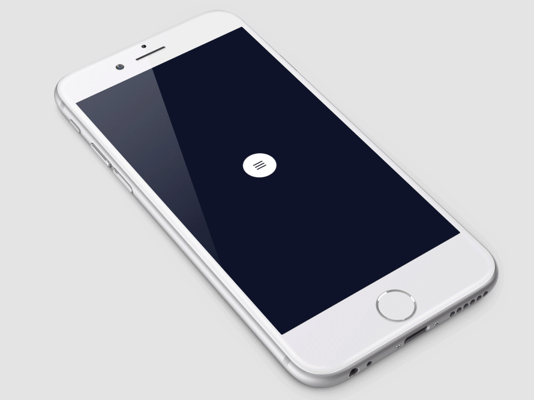

# CircleMenu
[](http://twitter.com/Ramotion)
[](https://cocoapods.org/pods/CircleMenu)
[](http://cocoapods.org/pods/CircleMenu)
[](https://cdn.rawgit.com/Ramotion/circle-menu/master/docs/index.html)
[](https://github.com/Ramotion/circle-menu)
[](https://codebeat.co/projects/github-com-ramotion-circle-menu)
[](https://travis-ci.org/Ramotion/circle-menu)


[shot on dribbble:](https://dribbble.com/shots/2534780-Circle-Menu-Swift-Open-Source)



The [iPhone mockup](https://store.ramotion.com/product/iphone-6-mockups?utm_source=gthb&utm_medium=special&utm_campaign=circle-menu) available [here](https://store.ramotion.com/product/iphone-6-mockups?utm_source=gthb&utm_medium=special&utm_campaign=circle-menu).

## Requirements

- iOS 8.0+
- Xcode 7.3

## Installation

Just add CircleMenuLib folder to your project.

or use [CocoaPods](https://cocoapods.org) with Podfile:

```ruby
pod 'CircleMenu', '~> 1.0.0'
```
or [Carthage](https://github.com/Carthage/Carthage) users can simply add to their `Cartfile`:
```
github "Ramotion/circle-menu"
```

## Usage

##### with storyboard

1) Create a new UIButton inheriting from `CircleMenu`

2) Add images for Normal and Selected state

3) Use delegate method to configure buttons

```swift
func circleMenu(circleMenu: CircleMenu, willDisplay button: CircleMenuButton, atIndex: Int)
```

4) Use properties to confiure CircleMenu

```swift
@IBInspectable var buttonsCount: Int = 3
@IBInspectable var duration: Double = 2 // circle animation duration
@IBInspectable var distance: Float = 100 // distance between center button and buttons
```

##### programmatically

```swift
let button = CircleMenu(
  frame: CGRect(x: 200, y: 200, width: 50, height: 50),
  normalIcon:"icon_menu",
  selectedIcon:"icon_close",
  buttonsCount: 4,
  duration: 4,
  distance: 120)
button.delegate = self
button.layer.cornerRadius = button.frame.size.width / 2.0
view.addSubview(button)
```

##### delegate methods

```swift
// configure buttons
optional func circleMenu(circleMenu: CircleMenu, willDisplay button: CircleMenuButton, atIndex: Int)

// call before animation
optional func circleMenu(circleMenu: CircleMenu, buttonWillSelected button: CircleMenuButton, atIndex: Int)

// call after animation
optional func circleMenu(circleMenu: CircleMenu, buttonDidSelected button: CircleMenuButton, atIndex: Int)

// call upon cancel of the menu
optional func menuCollapsed(circleMenu: CircleMenu)
```

## Licence

Circle menu is released under the MIT license.
See [LICENSE](./LICENSE) for details.

## About
The project maintained by [app development agency](https://ramotion.com?utm_source=gthb&utm_medium=special&utm_campaign=circle-menu) [Ramotion Inc.](https://ramotion.com?utm_source=gthb&utm_medium=special&utm_campaign=circle-menu)
See our other [open-source projects](https://github.com/ramotion) or [hire](https://ramotion.com?utm_source=gthb&utm_medium=special&utm_campaign=circle-menu) us to design, develop, and grow your product.

[](https://twitter.com/intent/tweet?text=https://github.com/ramotion/circle-menu)
[](https://twitter.com/ramotion)
